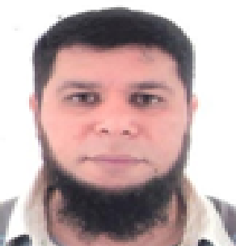

---
layout: page
title: Course Facilitators 
--- 

<h4 style="color:DodgerBlue;"> Prof. Saloshni Naidoo, Lead Facilitator: University of KwaZulu-Natal </h4> 
Associate Professor, School of Nursing and Public Health, UKZN, South Africa.  
Email: <a href="mailto:Naidoos71@ukzn.ac.za">Naidoos71@ukzn.ac.za</a>  

  Professor Saloshni Naidoo is the Head of the Department of Public Health Medicine, School of Nursing and Public Health at the University of KwaZulu-Natal, South Africa.  She obtained her medical degree from the University of Natal in 1992, became a Public Health Medicine Specialist in 2003 and an Associate in the Division of Occupational Medicine in the College of Public Health Medicine in 2010.  In 2006 she obtained a Master of Medicine Degree in Community Health from the University of KwaZulu-Natal, and in 2011 her PhD from the Institute of Risk Assessment Science, Utrecht University, Netherlands.  She is involved in undergraduate medical training and postgraduate public health education.  She is an NRF C2 rated researcher.  Her research interests are in “environmental impacts on women and child health and worker’s health” and “health systems strengthening”.  In 2021 she was awarded the Kofi Annan Fellowship in Global Public Health Leadership funded by the Kofi Annan Foundation and Africa CDC.  Her Leadership Challenge Project focused on supporting Health Leaders to use data to drive their planning and decision-making at a facility and district level.  She is the Programme Director of the NIH-DSI Africa grant “Research Training on Harnessing Data Science for Global Health Priorities in Africa” for developing Data Science in South Africa.  She is the local PI with Oslo University, Norway and collaborators from Greece, Denmark, eSwatini and Mozambique on a European Union Horizons grant adapting and validating a novel, spectral screening tool linked to a smartphone for the poverty-related disease, Female Genital Schistosomiasis (FGS), improving health care for vulnerable populations and strengthening the service delivery in the local context for women’s health.  Visit <a href="https://publichealth.ukzn.ac.za/staff/drsaloshninaidoo/" target="_blank">Prof. Naidoo's website</a> for more information about her work. 
  

<h4 style="color:DodgerBlue;"> Prof. Till Bärnighausen, Lead Facilitator: Heidelberg Institute of Global Health </h4>
Associate Professor, Heidelberg Institute of Global Health, Heidelberg University, Germany.  
Email: <a href="mailto:till.baernighausen@uni-heidelberg.de">till.baernighausen@uni-heidelberg.de</a>  

  Dr. Till Bärnighausen is Alexander von Humboldt Professor and Director of the Heidelberg Institute of Global Health (HIGH), Faculty of Medicine and University Hospital, University of Heidelberg, Germany. He is also Senior Faculty at the Welcome Trust’s Africa Health Research Institute (AHRI) in South Africa and a fellow at the Harvard Center for Population and Development Studies.  He is a Co-PI of the NIH-DSI Africa grant “Research Training on Harnessing Data Science for Global Health Priorities in Africa” for developing Data Science in South Africa. Till’s research focuses on establishing the causal impact of global health interventions on population health, social and economic outcomes. In particular, he works on large-scale population health interventions for HIV, diabetes, hypertension, and vaccine-preventable diseases. Till uses design research to develop interventions, randomized controlled experiments, and quasi-experiments to establish intervention impacts. He has developed several new methods for applied population health research.  His research interests are on causal impact of global health interventions on population health, social and economic outcomes.  Visit <a href="https://www.klinikum.uni-heidelberg.de/heidelberger-institut-fuer-global-health/directorate/members/baernighausen-till" target="_blank">Prof. Bärnighausen's website</a> for more information about his work.
 
  

<h4 style="color:DodgerBlue;"> Prof. Ozayr Mahomed, Lead Facilitator: University of KwaZulu-Natal </h4>
Associate Professor, School of Nursing and Public Health, UKZN, South Africa.  
Email: <a href="mailto:mahomedo@ukzn.ac.za">mahomedo@ukzn.ac.za</a>  

  Ozayr Mahomed is an Honorary Associate Professor within the Discipline of Public Health Medicine, University of KwaZulu Natal. He obtained his medical degree in 1996, became a Public Health Medicine specialist in 2006 and completed his PhD in 2016.  Over the last ten years, he fulfilled the roles of the Academic Coordinator for the Graduate Programme of Public Health, Coordinator for the Undergraduate courses within the medical curriculum by the Discipline, and served as Academic Leader for Research in the School of Public Health for a year. He served as the coordinator for the College of Public Health Medicine in South Africa. He has authored more than 60 peer-reviewed publications and served as a reviewer for a few international journals.  He has supervised three PhD students to completion to date, with a further 15 students at various stages of the process. He has graduated more than 50 master’s students. In addition to his academic contribution, Professor Mahomed serves as a technical expert to the Department of Health and has drafted several policy and guideline documents. His key strengths include health services management, health system strengthening, health economics and a systems approach to quality improvement.  Visit <a href="https://publichealth.ukzn.ac.za/staff/drozayrmahomed/" target="_blank">Prof. Mahomed's website</a> for more information about his work. 
  

<h4 style="color:DodgerBlue;"> Dr. Avashri Harrichandparsad, Co-facilitator </h4>
University of KwaZulu-Natal, South Africa.  
Email: <a href="mailto:HarrichandparsadA@ukzn.ac.za">HarrichandparsadA@ukzn.ac.za</a>  

  Avashri Harrichandparsad is a Public Health Medicine Specialist in the Department of Public Health Medicine. Her research portfolio includes 8 years of clinical trial experience at the HIV Prevention Research Unit of the Medical Research Council focusing on interventions designed specifically to empower women. She fulfilled the roles of Clinician and Principal Investigator on phase 1, 2 and 3 studies. Her research interests also include healthcare quality and health system strengthening. She has broad experience of the public healthcare system having worked at facility, district and provincial levels in the KZN Department of Health. She has most recently served as Acting Senior Manager of Medical Services at Inkosi Albert Luthuli Central Hospital.  Visit <a href="" target="_blank">Dr. Harrichandparsad's website</a> for more information about her work. 
  

<h4 style="color:DodgerBlue;"> Dr Swabhavika Singh, Co-facilitator </h4>
University of KwaZulu-Natal, South Africa.  
Email: <a href="mailto:swabhavika.singh@gmail.com">swabhavika.singh@gmail.com</a>  

  Swabhavika Singh obtained her medical degree in 2011 at the University of KwaZulu-Natal and has clinical experience at district, regional and central hospitals. She obtained a Masters of Science in Bioethics and Health Law at the University of Witwatersrand in 2018 and has completed her Masters of Medicine in Public Health. She served an internship at the World Health Organisation in Geneva during May-April 2019 within the Family, Women, Adolescent and Child Health cluster. She is currently completing her final year as a Public Health Medicine Registrar within the Discipline of Public Health Medicine, University of KwaZulu-Natal.  Visit <a href="" target="_blank">Dr. Singh's website</a> for more information about her work. 
  

<h4 style="color:DodgerBlue;"> Vidaisha Naidoo, Co-facilitator </h4>
University of KwaZulu-Natal, South Africa.  
Email: <a href="mailto:211509368@stu.ukzn.ac.za">211509368@stu.ukzn.ac.za</a>  

  Vidaisha Naidoo is a third year Public Health Medicine registrar at the University of KwaZulu-Natal’s School of Nursing and Public Health. Vidaisha qualified as a medical doctor in 2016 and obtained her Bachelor of Medicine and Surgery (MBChB) from the University of KwaZulu-Natal. Vidaisha completed her internship at General Justice Gizenga Mpanza Regional Hospital in 2018 and completed community service at Inanda A Community Health Centre in 2019. Vidaisha worked as a medical officer at General Justice Gizenga Mpanza Regional Hospital until 2021, in the Family Medicine and HIV units. Vidaisha has a special interest in public health data management, health information systems and health technology.  Visit <a href="" target="_blank">Naidoo's website</a> for more information about her work. 
  

<h4 style="color:DodgerBlue;"> Dr. Mohanad Mohammed, Co-facilitator </h4>
WASHU Takwimu Postdoctoral Fellow, UKZN, South Africa.  
Email: <a href="mailto:MohammedmM1@ukzn.ac.za">MohammedmM1@ukzn.ac.za</a>  

  WASHU Takwimu Postdoctoral Fellow, University of KwaZulu-Natal. Mohanad Mohammed earned his PhD from the School of Mathematics, Statistics, and Computer Science (SMSCS), specializing in Statistics at the University of KwaZulu-Natal (UKZN) in 2022. During his MSc and PhD studies, he worked as a tutor and an Adhoc lecturer in SMSCS at the same university, which continued from 2019 to 2022. He is currently a post-doc fellow working on a health data science project hosted by UKZN in collaboration with Harvard T. H. Chan, School of Public Health, USA, and Heidelberg University and Germany. His research has focused on developing and applying statistical methods in genomics, genetics, public health, and the environment. He is interested in contributing to a deeper understanding of cancer disease modeling using gene expression data to facilitate decision-making concerning diagnosis, treatment, and care. In addition, Mohammed has authored and co-authored many articles, ten of which have been published in reputable journals and conference papers. He has attended and presented at various international and local workshops and conferences and is an active member of the biostatistics team under the MASAMU program.  Visit <a href="" target="_blank">Dr. Mohammed's website</a> for more information about his work. 
  

