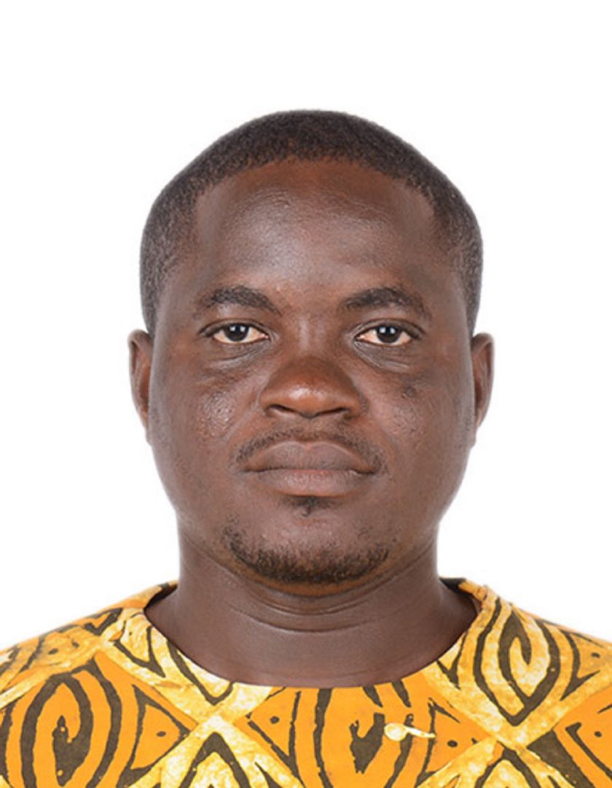

---
layout: page
title: Course Participants 
--- 

<h4 style="color:DodgerBlue;"> Ninza	Sheyo,  Postgraduate Student in Public Health, University of KwaZulu-Natal </h4> 
Email: <a href="mailto:ninza.sheyo@gmail.com">ninza.sheyo@gmail.com</a>  

  Ninza	Sheyo is an anaesthesiologist and a critical care specialist with a particular interest in health systems strengthening, global health and humanitarian medicine. My goal is to optimise operational efficiency, drive growth in the donor base, and maintain the highest standards of quality and safety in blood services.  
<b>Research Interest: </b>Health systems strengthening.  
  

<h4 style="color:DodgerBlue;"> Mthobisi	Zondi,  Postgraduate Student in Statistics, University of KwaZulu-Natal </h4> 
Email: <a href="mailto:mm.zondi3@gmail.com">mm.zondi3@gmail.com</a>  

  Mthobisi	Zondi has worked on multi-country research and assisted with data analysis for different academic goals at CAPRISA. he also gave lectures at DUT, teaching business statistics and mathematics. Throughout his postgraduate studies, he functioned as a demonstrator, and his thesis resulted in two research articles.  
<b>Research Interest: </b>Child's health, longitudinal data, country variability.  
  

<h4 style="color:DodgerBlue;"> Usama Hussein Mutebi,  Research Fellow, School Of Public Health, Makerere University </h4> 
Email: <a href="mailto:Usamhussen@gmail.com">Usamhussen@gmail.com</a>  

  Usama Hussein Mutebi is a Student researcher at Makerere University, School of Public Health. Usama's main areas of research are in applied biostatistics, infectious disease modelling, Data science and big data analytics and climate change. Usama holds a Master of Biostatistics, Bachelor of science in mathematics and a Bachelor of Education. He aims to  passionately develop and enhance the teaching, learning and application of rigorous  biostatistics and data science skills and knowledge in making better public health analytics and visualizations in his motherland(Uganda), the Sub-Saharan Africa region and Africa at large.  
<b>Research Interest: </b>Machine learning, Data science and big public health data Analytics, climate change.  
  

<h4 style="color:DodgerBlue;"> Ntandokayise Makhathini, Postgraduate Student, University of KwaZulu-Natal </h4> 
Email: <a href="mailto:ntandoleonex@gmail.com">ntandoleonex@gmail.com</a>  

  Ntandokayise Makhathini is passionate about understanding wildlife and freshwater ecology, I find joy in exploring their intricate workings. My outgoing personality drives me to engage with new people, sharing enriching experiences. Traveling the world broadens my horizons, allowing me to immerse myself in diverse cultures and landscapes, constantly seeking inspiration.  
<b>Research Interest: </b> Inland-fisheries, ecology ,fish.  
  

<h4 style="color:DodgerBlue;"> Bernard Obo Essah, Lecturer, Koforidua Technical University </h4> 
Email: <a href="mailto:oboessah@gmail.com">oboessah@gmail.com</a>  

  Bernard is a self-motivated young person, who sees the problems of the world as opportunities. He feels comfortable with his identity and has a strong sense that his environment is comprised of clear, logical, and consistent rules and features. He hold a HND, BSc, MPhil. all in (Statistics) and has applied for a PhD In Applied Mathematics  with specialization in Data Science. He is into statistical programming with R and Python and loves educating, research, and counseling. His major academic area is Mathematical Science [Applied Mathematics and Statistics in Big Data Science Technology].  
<b>Research Interest: </b> Applied Mathematics; Health & Data Science Statistics; Education Research.  
  

<h4 style="color:DodgerBlue;"> Sarah Ogutu, Postgraduate Student, University of KwaZulu-Natal </h4> 
Email: <a href="mailto:ogutusarah@gmail.com">ogutusarah@gmail.com</a>  

  Sarah is a young, ambitious, and passionate statistics PhD researcher specializing in health data analysis, focusing on Infectious Diseases and Biostatistics methodologies. Her current project is machine learning for complex high-dimensional longitudinal and survival health data. She holds an MSc. in Statistics and is eager to network and collaborate on impactful public health projects with innovative research practices.  
<b>Research Interest: </b> Survival analysis; longitudinal analysis; machine learning.  
  

<h4 style="color:DodgerBlue;"> Adikwor Ewoenam Puplampu, Postgraduate Student, School of Public Health (UG-SPH), University of Ghana </h4> 
Email: <a href="mailto:aepuplampu@gmail.com">aepuplampu@gmail.com</a>  

  Adikwor Ewoenam Puplampu is deeply engaged in the exploration of critical health issues as a PhD candidate at the UG-SPH, Ghana. Her academic journey is complemented by her role as a research officer at the Sweden Ghana Medical Centre, where she actively contributes to advancing healthcare solutions by teaching and coordinating research activities.  
<b>Research Interest: </b> Surveys and general data analysis, health data management, survival analysis.  
  

<h4 style="color:DodgerBlue;"> Michael Msangawale, Postgraduate Student, University of KwaZulu-Natal </h4> 
Email: <a href="mailto:mmsangawale@blood.ac.tz">mmsangawale@blood.ac.tz</a>  

  Michael Msangawale is a data manager with a background in information system and network engineering. He is passionate about using technology to optimize processes and drive efficiency. In addition, he is dedicated to translating data into actionable insights for decision-making.  
<b>Research Interest: </b> Sickle cell disease; big data; electronic health records; clinical trials; patient registries; health disparities; data integration; data sharing; data security; informed consent; data governance; data quality assurance.  
  

<h4 style="color:DodgerBlue;"> Rehema Shungu, Postgraduate Student, Muhimbili University of Health and Allied Sciences </h4> 
Email: <a href="mailto:rshungu08@gmail.com">rshungu08@gmail.com</a>  

  Rehema Shungu holds a Bachelor's in Biotechnology and Laboratory Science, she transitioned to Data Science, currently pursuing a Master's degree. Over two years, she has worked as a Bioinformatician/Data Analyst, specializing in biological datasets and clinical information analysis. Moreover, she passionate about leveraging data for impactful insights.  
<b>Research Interest: </b> Data science; machine learning; public health.  
  

<h4 style="color:DodgerBlue;"> Kwena Tlhaku, Postgraduate Student, Discipline of Public Health, University of KwaZulu-Natal  </h4> 
Email: <a href="mailto:217003232@Stuu.ukzn.ac.za">217003232@Stuu.ukzn.ac.za</a>  

  Kwena Rayneth Tlhaku is an ambitious and dedicated social science researcher with a background in Social Work. She works as a study coordinator at CAPRISA's HIV Vaccines and Pathogenesis department, focusing on strengthening health systems through audit and programmatic data evaluation. She is also PhD research fellow at CAPRISA, contributing to advancements in public health.  
<b>Research Interest: </b> Public Health; Epidemiology; HIV/AIDS.  
  

<h4 style="color:DodgerBlue;"> Samkelisiwe Ngcobo, Postgraduate Student, University of KwaZulu-Natal  </h4> 
Email: <a href="mailto:sam.p.ngcobo@gmail.com">sam.p.ngcobo@gmail.com</a>  

  Samkelisiwe Ngcobo is a postdoctoral research fellow at the University of KwaZulu-Natal (UKZN), her passion for animals and the natural world fuels her pursuit of ecological understanding. Driven by this passion, her research focuses on the complex dynamics of human-wildlife conflicts amplified by anthropogenic change, particularly within urban ecosystems. Through this work, she seeks to contribute to wildlife conservation in these rapidly changing environments.  
<b>Research Interest: </b> Anthropogenic changes; conservation; biodiversity; urban ecology.  
  

